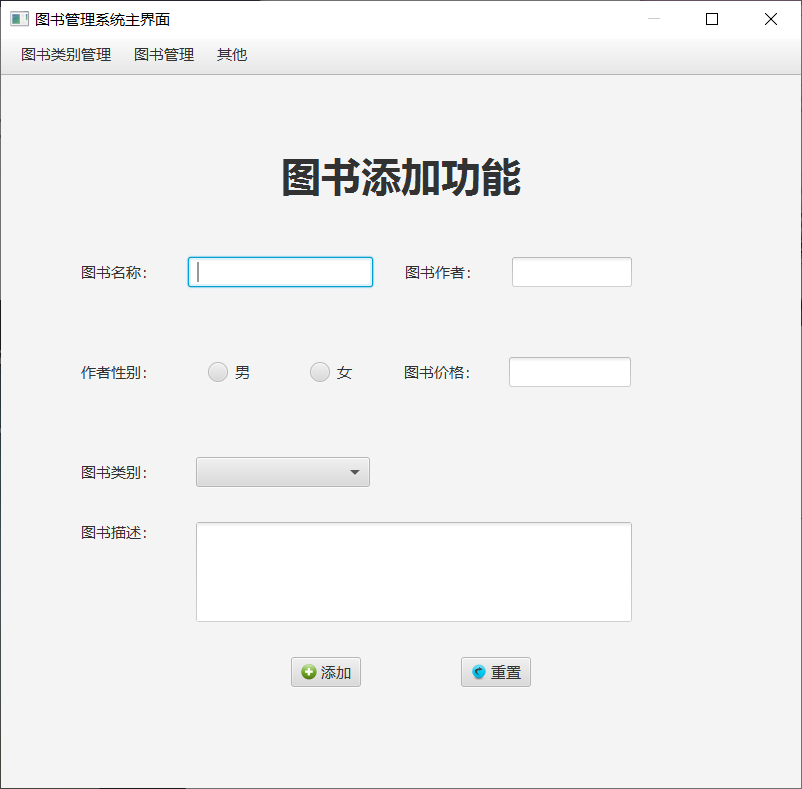
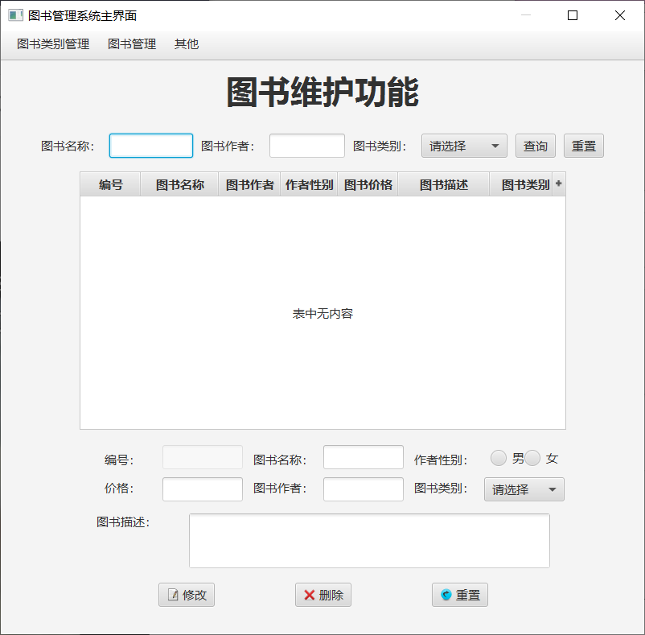
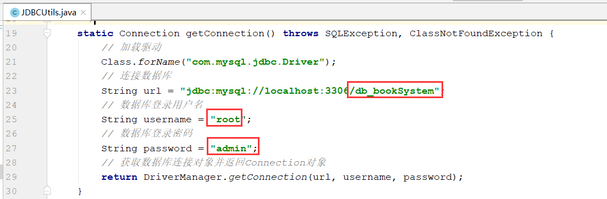

[toc]

# BookManageSystem_javafx

## 项目介绍

图书管理系统，通过swing展示数据。

运行截图如下：

- 登录页面

登录账户，这里没有调用数据库，而是使用默认唯一账户：（**用户名：张三；密码：123456**）。

- 主界面

- 图书添加

- 图书维护

## 使用指导

第一步：修改数据库连接参数在JDBCUtils.java中的getConnection()方法中

第二步：运行Main.java类的main()方法。

第三步：登录账户，这里没有调用数据库，而是使用默认唯一账户：（**用户名：张三；密码：123456**）。

## 目录说明

- file

该目录下有两个文件，其中是一个连接MySQL数据库所需要的jar包，另一个是项目所使用的数据库表SQL，需要先创建名为db_booksystem的数据库，再在其下执行该db_booksystem.sql中的语句。

- images

该目录下存放的是README.md文件中所需要用到的图片资源。

- src

该目录下是本项目的源代码。

## 参考链接

[Java实战之图书管理系统（JavaFX版）（1）——项目简述](http://mp.weixin.qq.com/s?__biz=MzU4MDc0NDI0NQ==&mid=2247484607&idx=1&sn=b294dbd3a21373c79ed23657039d3529&chksm=fd5361e5ca24e8f37878357cdeee097889b2f8a87229f60b6a5ac8590201c2d201e02b4aa1be&scene=21#wechat_redirect)

[Java实战之图书管理系统（JavaFX版）（2）——功能介绍](http://mp.weixin.qq.com/s?__biz=MzU4MDc0NDI0NQ==&mid=2247484719&idx=1&sn=4d3a007becb6660496b82654cda14e50&chksm=fd536075ca24e963a3f78ebd37e22b75188ef311976f63716f9f22370702f490242a421f3ccd&scene=21#wechat_redirect)

[Java实战之图书管理系统（JavaFX版）（3）——数据库表](http://mp.weixin.qq.com/s?__biz=MzU4MDc0NDI0NQ==&mid=2247484767&idx=1&sn=8c630a6c115ae7b77a30212f635fdb6c&chksm=fd536005ca24e913968b1af843f8cea0d2193a97e81caa7fea77fac70e77ea67cd06e235d439&scene=21#wechat_redirect)

[Java实战之图书管理系统（JavaFX版）（4）——登录界面及功能实现](http://mp.weixin.qq.com/s?__biz=MzU4MDc0NDI0NQ==&mid=2247484768&idx=1&sn=c29a9b4e953fa2f0b55bfd2b9fa4ac5b&chksm=fd53603aca24e92c085a0c970b0677489155fcd7e6b97d324f76f634064328aab97d978138e7&scene=21#wechat_redirect)

[Java实战之图书管理系统（JavaFX版）（5）——主界面及功能实现](http://mp.weixin.qq.com/s?__biz=MzU4MDc0NDI0NQ==&mid=2247484769&idx=1&sn=963ff0276235865c28cf11ea0221a429&chksm=fd53603bca24e92dcac9728fa45acc2dcb4590e2caa78a813c296f26320705b7d2bc94274f59&scene=21#wechat_redirect)

[Java实战之图书管理系统（JavaFX版）（6）——图书类别添加功能实现](http://mp.weixin.qq.com/s?__biz=MzU4MDc0NDI0NQ==&mid=2247484957&idx=1&sn=21097846bc55ca3ad90bdc7dc804ae7a&chksm=fd536347ca24ea51e4a6f934c6bbbfde5325b9395cab6b1cb2c9f3f65e4fbe69605a300024ab&scene=21#wechat_redirect)

[Java实战之图书管理系统（JavaFX版）（7）——图书类别维护界面及功能实现](http://mp.weixin.qq.com/s?__biz=MzU4MDc0NDI0NQ==&mid=2247485038&idx=1&sn=e8f9e30f5846a5aa4d04566d3115f19c&chksm=fd536334ca24ea22bc91bb625ab16f9521d21841a551b8453c3460155e779d2c7c01bb630a42&scene=21#wechat_redirect)

[Java实战之图书管理系统（JavaFX版）（8）——图书添加界面及功能实现](http://mp.weixin.qq.com/s?__biz=MzU4MDc0NDI0NQ==&mid=2247485139&idx=1&sn=513d2ee316cfbaab9062995f98f5995e&chksm=fd536389ca24ea9f038777e15bf292d1b01776c9a7a9db237d1bcc6a4e64e477d8247d95a40a&scene=21#wechat_redirect)

[Java实战之图书管理系统（JavaFX版）（9）——图书维护界面及功能实现](http://mp.weixin.qq.com/s?__biz=MzU4MDc0NDI0NQ==&mid=2247485210&idx=1&sn=8c993c8f709646b7d71c814d2b3e141f&chksm=fd536240ca24eb56fbf62c0465a7fc50c783a3be3f4fe0f5709d5b9c0597cd9624917b5dbe86&scene=21#wechat_redirect)

[Java实战之图书管理系统（JavaFX版）（10）——其他界面及功能实现](http://mp.weixin.qq.com/s?__biz=MzU4MDc0NDI0NQ==&mid=2247485212&idx=1&sn=486377521e22b83c128473a7cc437e58&chksm=fd536246ca24eb50aef2de333545428f122304649d4b39527ce3237f0bcb28830e5a1ddc62cc&scene=21#wechat_redirect)